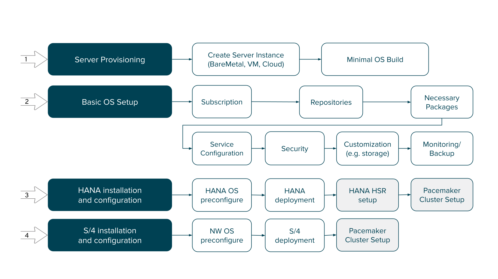

# Installing and Configuring Ansible Roles for Base Configuration of SAP Systems

## Overview of the Installation Workflow

The installation of an SAP system can be divided into the following
steps:

1. Provisioning of the servers

2. Basic operating system configuration, which is often referred to as Corporate Standard Build

3. Installation of SAP HANA database

4. Installation of SAP NetWeaver-based application such as SAP S/4HANA



The server provisioning (step 1) is typically the most individual part
for each customer in this workflow. For example, it could involve the
following activities:

- Bare metal rack mounting, cabling, and kickstarting, or with a
  pre-provisioned operating system by the supplier

- Virtual environments with kickstart or image provisioning

- A public or private cloud with image provisioning

Thus, this initial phase can be achieved in many ways It might need
manual intervention for bare metal servers. Automation tools such as
Ansible, terraform, or other scripts might be involved.

They all have in common that the end result is at least a minimal RHEL
system with fully attached resources (disk, CPU, and memory) that are
reachable via `ssh` from an Ansible host.

In step 2, these resources must be configured according to corporate
standards, including monitoring, backup, security, and other compliance
rules. Storage, network and other configuration could be done here as
well. The Red Hat Enterprise Linux System Roles collection provides many
useful roles to achieve this basic operating system setup.

Step 3 covers the installation of the SAP HANA database, as a foundation
for all applications such as B/4HANA or S/4HANA that run on top of the
database. This installation can be done stand-alone or as highly
available by using HANA System Replication (HSR).

Finally, step 4 installs the NetWeaver application servers together with
the SAP application (such as S/4HANA) and connects to the database that
was installed in step 3.

## Overview of Needed Collections and Roles for SAP Installations

For installing SAP HANA, these roles from the following collections
might be useful:

    Linux System Roles Collection (`redhat.rhel_system_roles`)

    - `rhel_system_roles.storage`,
      [](https://console.redhat.com/ansible/automation-hub/repo/published/redhat/rhel_system_roles/content/role/storage) -
      for the storage configuration of your systems

    - `rhel_system_roles.timesync`,
      [](https://console.redhat.com/ansible/automation-hub/repo/published/redhat/rhel_system_roles/content/role/timesync) -
      for proper time synchronization

    - `rhel_system_roles.network`,
      [](https://console.redhat.com/ansible/automation-hub/repo/published/redhat/rhel_system_roles/content/role/network) -
      for complex network configurations, which are typical in SAP
      environments

1. SAP Installation Collections (`redhat.sap_install`)

    - `sap_install.sap_general_preconfigure`,
      [](https://console.redhat.com/ansible/automation-hub/repo/published/redhat/sap_install/content/role/sap_general_preconfigure) -
      configures general requirements for SAP software

    - `sap_install.sap_hana_preconfigure`,
      [](https://console.redhat.com/ansible/automation-hub/repo/published/redhat/sap_install/content/role/sap_hana_preconfigure) -
      configures SAP HANA-specific requirements

    - `sap_install.sap_hana_install`,
      [](https://console.redhat.com/ansible/automation-hub/repo/published/redhat/sap_install/content/role/sap_hana_install) -
      runs the `hdblcm` SAP HANA installer unattended

For installing SAP NetWeaver, these roles from the following collections
might be useful:

1. Linux System Roles Collection (`redhat.rhel_system_roles`)

    - `rhel_system_roles.storage`,
      [](https://console.redhat.com/ansible/automation-hub/repo/published/redhat/rhel_system_roles/content/role/storage) -
      for the storage configuration of your systems

    - `rhel_system_roles.timesync`,
      [](https://console.redhat.com/ansible/automation-hub/repo/published/redhat/rhel_system_roles/content/role/timesync) -
      for proper time synchronization

    - `rhel_system_roles.network`,
      [](https://console.redhat.com/ansible/automation-hub/repo/published/redhat/rhel_system_roles/content/role/network) -
      for complex network configurations, which are typical in SAP
      environments

2. SAP Installation Collections (`redhat.sap_install` and
    `community.sap_install`)

    - `sap_install.sap_general_preconfigure`,
      [](https://console.redhat.com/ansible/automation-hub/repo/published/redhat/sap_install/content/role/sap_general_preconfigure) -
      configures general requirements for SAP software

    - `sap_install.sap_netweaver_preconfigure`,
      [](https://console.redhat.com/ansible/automation-hub/repo/published/redhat/sap_install/content/role/sap_netweaver_preconfigure) -
      configures SAP NetWeaver-specific requirements

    - `sap_install.sap_swpm`,
      [](https://github.com/sap-linuxlab/community.sap_install/blob/main/roles/sap_swpm/README.md) -
      executes `sapinst` with created configuration file for
      unattended installation

Click each of these roles for details of how to use them.

## Important Parameters for Roles that Prepare SAP Installations

This section explains the most important parameters for the roles that
prepare a system to get HANA or NetWeaver software. You can use a more
granular configuration of each role, which you can find in the
documentation.

### rhel_system_roles.storage

SAP servers have storage requirements that depend on the server size. A
detailed SAP HANA sizing guide is attached to _SAP Note \#1900823_ at
[](https://launchpad.support.sap.com/#/notes/1900823). SAP NetWeaver has
special requirements for the swap space.

SAP HANA needs three volumes. The data volume is a copy of the in-memory
data at a certain time, and the log volume stores each additional
transaction to ensure the recovery of the database with zero data loss
in the event of a failure. Thus, these two volumes are
performance-critical. The shared volume contains all binaries, trace
files, and configuration files. Thus, additional space is required for
the traces that are written by the compute nodes of the SAP HANA
database. Experiences with productive SAP HANA installations show that
the larger the size of the SAP HANA database, the more traces are
written. Therefore, the calculation is based on the total memory
requirement (RAM). Some other binaries are stored in the `/usr/sap`
directory, and so it is recommended to store them in a separate volume.

To configure the storage appropriately, this role can be used. According
to the sizing guides, a single-node SAP HANA system requires the
following storage volumes:

- `/hana/shared/<SID>`: minimum 1x RAM, 1 TB

- `/hana/data/<SID>`: 1.2x anticipated net data size on disk

- `/hana/log/<SID>`: minimum RAM/2, 512 GB

An example variable configuration for a 128 GB system might look as
follows:


```yaml
storage_pools:
      - name: sap
        disks:
          - sdb
          - sdc
          - sdd
          - sde
          - sdf
        volumes:
          - name: data
            size: "128 GiB"
            mount_point: "/hana/data"
            fs_type: xfs
            state: present
          - name: log
            size: "64 GiB"
            mount_point: "/hana/log"
            fs_type: xfs
            state: present
          - name: shared
            size: "128 GiB"
            mount_point: "/hana/shared"
            fs_type: xfs
            state: present
          - name: sap
            size: "50 GiB"
            mount_point: "/usr/sap"
            state: present
```
{% endraw % }

For initial installations, it can be useful to set the
`storage_safe_mode` variable to `false`. In that case, existing
configurations are overwritten.

### rhel_system_roles.timesync

SAP requires proper time synchronization. This Linux system role is a
proper way to set the time. It can be used with different providers,
such as `chrony` or `ntpd`.

The following example configures the `chrony` time server:


```yaml
timesync_ntp_servers:
      - hostname: 0.rhel.pool.ntp.org
        iburst: yes
timesync_ntp_provider: chrony
```


### rhel_system_roles.network

Although this role is not needed in this course, it is a valuable role
for SAP setups, because a production system typically has separate
networks or VLANs for the following purposes:

- Public network to access the SAP service

- Cluster interconnect

- Administrative network (to run Ansible)

- Maybe others

An example variable configuration might look as follows:


```yaml
network_provider: nm
network_connections:
- name: admin
  interface_name: eth0
  #persistent_state: present  # default
  type: ethernet
  autoconnect: yes
  mac: "00:00:5e:00:53:5d"
  ip:
    dhcp4: yes

# Create a bond profile, which is the parent of VLAN.
- name: prod2
  state: up
  type: bond
  interface_name: bond2
  ip:
    dhcp4: no
    auto6: no
  bond:
    mode: active-backup
    miimon: 110

  # enslave an ethernet to the bond
  - name: prod2-slave1
    state: up
    type: ethernet
    interface_name: eth1
    master: prod2

  # on top of it, create a VLAN with ID 100 and static
  # addressing
  - name: prod2.100
    state: up
    type: vlan
    parent: prod2
    vlan_id: 100
    ip:
      address:
        - "192.0.2.72/24"
      auto6: no


network_allow_restart: yes
```


You might add another interface to the bond or a more detailed IP
configuration. The concept should be clear by now.

### sap_general_preconfigure

SAP requires a couple of basic settings that are described in _SAP Note
2369910_, [](https://launchpad.support.sap.com/#/notes/2369910), and
some other SAP notes. The `sap_general_preconfigure` role defines the
parameters that must be set for all SAP software.

The role is designed to be used without parameters to produce valid
output.

An important requirement for SAP is to set up the hostname and DNS
according to SAP guidelines. The role verifies this setup and can fix
it. Because it can be destructive, or because customers might have other
ways to ensure proper DNS and host configuration setup, the default is
that the role checks DNS only, and issues warnings if it is not set
according to SAP requirements.

To ensure configuration of the correct hostname resolution, the role can
update the `/etc/hosts` file with the correct configuration in a
non-destructive way. All previous aliases are kept. To apply changes in
the `/etc/hosts` file, the following variable must be set:

    sap_general_preconfigure_modify_etc_hosts: true

When making these changes, the role assumes that the public interface
for the SAP service is the same as the interface that is used for
accessing the node via Ansible. In a production environment, the public
interface of the SAP service is likely to be different from the
administrative interface. The following variables must be set
accordingly when you allow changes to the `/etc/hosts` file:

- `sap_hostname`: The short hostname of the public IP of the SAP
  server. It defaults to `ansible_hostname`.

- `sap_domain`: The DNS domain of the SAP server. It defaults to
  `ansible_fqdn`.

- `sap_ip`: The IP address of the SAP server. It defaults to
  `ansible_default_ipv4.address`.

The role is designed not to update a server, and to stop with an error
message if something occurs that requires a reboot. The reason is to
respond correctly to a reboot situation, and not to reboot a production
system by accident after updating.

When installing a fresh system, the system must be updated and rebooted
before the SAP software installation. To enable this behavior, set the
following variables:

    sap_general_preconfigure_update: true
    sap_general_preconfigure_fail_if_reboot_required: false
    sap_general_preconfigure_reboot_ok: true

The DNS setup of the servers is only tested and might not be completely
correct. The role throws errors, but is not failing if DNS setup is not
correct, provided that the required name resolution works with files.
However, it is recommended to have proper DNS in production.

### sap_hana_preconfigure

The `sap_hana_preconfigure` role does all preconfiguration steps for SAP
HANA, which are described in many applicable SAP Notes. The SAP Notes
that apply to the underlying operating system and Infrastructure as a
Service (IaaS) platform are automatically selected, so that it works
identically for on-premise or on cloud, on Intel or on Power LE.

This role can be used without any additional parameters, although some
might be adjusted in production, such as some kernel parameters. [SAP
Note \#238241](https://launchpad.support.sap.com/#/notes/238241) defines
many kernel parameter options, which can be set in the
`sap_hana_preconfigure_kernel_parameters` variable. However, for an
initial setup, the default parameters are suitable.

For more information about the parameters, read the role description, or
see the role default variable definitions at
[](https://raw.githubusercontent.com/sap-linuxlab/community.sap_install/main/roles/sap_hana_preconfigure/defaults/main.yml).

The role can be used to verify the environment before a HANA update or
for a fresh installation. Thus, the default behavior of the role is not
to update, and to verify whether updates occurred previously and the
system needs a reboot. If this case applies, then the role fails and the
administrator can fix it before a SAP HANA update. For a fresh
installation, it is good to update the system and to reboot before the
HANA installation. To apply that behavior, set the following variables:

    sap_hana_preconfigure_update: true
    sap_hana_preconfigure_fail_if_reboot_required: false
    sap_hana_preconfigure_reboot_ok: true

The purpose of these variables is identical to the
`sap_general_preconfigure` role.

Now you have an overview of the roles that prepare Red Hat Enterprise
Linux to install SAP software.

## Additional Information

[Linux System Roles
(Upstream)](https://galaxy.ansible.com/fedora/linux_system_roles)

[Red Hat Enterprise Linux System Roles Ansible
Collection](https://console.redhat.com/ansible/automation-hub/repo/published/redhat/rhel_system_roles)

[How to Configure Network Settings with Ansible System
Roles](https://www.redhat.com/sysadmin/configure-network-ansible-roles)

[Community SAP Installation
Collection](https://galaxy.ansible.com/community/sap_install)

[Red Hat SAP Installation
Collection](https://console.redhat.com/ansible/automation-hub/repo/published/redhat/sap_install)

[Red Hat Enterprise Linux System Roles knowledge base
article](https://access.redhat.com/articles/3050101)

[BLOG: The Ultimate Guide to Effective Sizing of SAP
HANA](https://blogs.sap.com/2017/03/07/the-ultimate-guide-to-effective-sizing-of-sap-hana/)

[Recommended File System
Layout](https://bit.ly/sap-hana-filesystem-layout)
